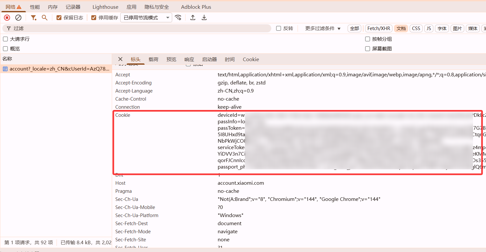

# xiaogpt

> 本项目 fork 自 [yihong0618/xiaogpt](https://github.com/yihong0618/xiaogpt)，在原项目基础上进行了修改和扩展。

## 支持的 AI 类型

通过 [LangChain](https://python.langchain.com/) 统一接入，支持以下 provider：

| Provider                                                  | `model_provider` | 默认模型                 | API Key 环境变量    |
| --------------------------------------------------------- | ---------------- | ------------------------ | ------------------- |
| [OpenAI](https://platform.openai.com/)                    | `openai`         | `gpt-4o-mini`            | `OPENAI_API_KEY`    |
| [Google Gemini](https://makersuite.google.com/app/apikey) | `google-genai`   | `gemini-2.5-flash-lite`  | `GEMINI_KEY`        |
| [Groq (Llama3)](https://console.groq.com/docs/quickstart) | `groq`           | `llama3-70b-8192`        | `GROQ_API_KEY`      |
| [Moonshot](https://platform.moonshot.cn/)                 | `openai`         | `moonshot-v1-8k`         | `MOONSHOT_API_KEY`  |
| [ChatGLM](http://open.bigmodel.cn/)                       | `openai`         | `glm-4`                  | `CHATGLM_KEY`       |
| [通义千问](https://help.aliyun.com/zh/dashscope/)         | `openai`         | `qwen-turbo`             | `DASHSCOPE_API_KEY` |
| [01万物](https://platform.lingyiwanwu.com/apikeys)        | `openai`         | `yi-34b-chat-0205`       | `YI_API_KEY`        |
| [豆包](https://console.volcengine.com/)                   | `openai`         | `skylark-chat`           | `volc_api_key`      |
| [PPIO (DeepSeek)](https://api.ppinfra.com/)               | `openai`         | `deepseek/deepseek-v3.2` | `PPIO_API_KEY`      |

> 任何 OpenAI 兼容的 API 服务都可以通过 `model_provider: openai` + `api_base` 接入。
> 旧版 `bot=chatgptapi` 等配置仍然兼容，会自动映射到对应的 provider。

## Python 版本支持

- **主分支**: Python >= 3.9
- **Python 3.8 分支**: `python38-support`（使用 LangChain 0.2.x）

### Python 3.8 用户安装

```bash
# 克隆 Python 3.8 专用分支
git clone -b python38-support https://github.com/minews/MiGpt.git xiaogpt
cd xiaogpt

# 安装依赖（使用 uv）
uv python pin 3.8
uv venv
uv sync --no-dev

# 运行
uv run python -m xiaogpt --config xiao_config.yaml
```

注意：Python 3.8 分支使用 LangChain 0.2.x，部分新功能（如 MCP 工具）需要 Python >= 3.10。

## 获取小米音响 DID

本项目使用 Cookie 认证，无需安装额外依赖或配置账号密码。

## 准备

1. LLM API Key（OpenAI / Gemini / Groq 等任一即可）
2. 小爱音响
3. 能正常联网的环境或 proxy
4. Python 3.8+（主分支需要 3.9+，Python 3.8 请使用 `python38-support` 分支）

## 快速开始

### 1. 准备配置文件

复制示例配置文件并重命名：

```shell
cp xiao_config_example.yaml xiao_config.yaml
```

### 2. 获取小米账号 Cookie

1. 在浏览器中打开 <https://account.xiaomi.com/> 并登录
2. 按 `F12` 打开开发者工具，切换到 **Network（网络）** 面板
3. 刷新页面，找到任意一条请求，在请求头中复制 `Cookie` 字段的完整内容（如下图所示）



4. 将 cookie 填入 `xiao_config.yaml` 的 `cookie` 字段：

```yaml
cookie: "deviceId=xxx; userId=xxx; passToken=xxx; ..."
```

### 3. 安装依赖

安装 [uv](https://docs.astral.sh/uv/getting-started/installation/)，然后执行：

```shell
uv sync
```

### 4. 获取设备 DID

运行以下命令查询你的小爱音箱设备列表：

```shell
uv run test_device_list.py
```

输出示例：

```json
[
  {
    "name": "小爱触屏音箱",
    "mi_did": "1111111",
    "hardware": "LX04"
  }
]
```

将 `mi_did`,`hardware` 的值填入 `xiao_config.yaml`：

```yaml
mi_did: "1111111"
hardware: "LX04"
```

### 5. 配置 AI

在 `xiao_config.yaml` 中填写 AI 相关字段，例如使用 OpenAI 兼容接口：

```yaml
model_provider: openai
model_name: gpt-4o
openai_key: "sk-xxxx"
api_base: "https://api.openai.com/v1"
```

### 6. 启动

```shell
uv run start.py
```

启动后即可通过小爱音箱与 AI 对话。说出配置的触发词（默认"请"）开头的问题即可激活 AI 回复。

---

## 使用

本项目仅支持通过配置文件启动，不支持命令行参数。请参考[快速开始](#快速开始)完成配置后运行：

```shell
uv run start.py
```

- 说出配置的触发词（默认 `请`）开头的问题即可激活 AI 回复
- 可以跟小爱说 `开始持续对话` 自动进入持续对话状态，`结束持续对话` 结束持续对话状态
- 默认用 ubus 与设备交互，如果你的设备不支持 ubus，可在配置文件中设置 `use_command: true`
- 设置 `mute_xiaoai: true` 可快速停掉小爱自己的回答

## xiao_config.yaml

本项目通过 `xiao_config.yaml` 配置文件启动，配置文件必须是合法的 YAML 格式。可参考 `xiao_config_example.yaml` 创建：

```shell
cp xiao_config_example.yaml xiao_config.yaml
```

配置文件示例：

```yaml
hardware: LX06
cookie: "deviceId=xxx; passToken=xxx; ..."
mi_did: "1111111"
stream: true
mute_xiaoai: true

model_provider: openai
model_name: gpt-4o-mini
openai_key: "sk-xxxx"
api_base: "https://api.openai.com/v1"
```

## MCP 工具（可选）

xiaogpt 支持通过 [MCP (Model Context Protocol)](https://modelcontextprotocol.io/) 为 LLM 添加工具能力。在配置文件中声明 `mcp_servers` 即可自动加载。

> 需要 Python >= 3.10

```yaml
mcp_servers:
  # 本地 stdio 类型的 MCP server
  - name: "weather"
    transport: "stdio"
    command: "python"
    args: ["-m", "weather_mcp_server"]

  # 远程 SSE 类型的 MCP server
  - name: "home_control"
    transport: "sse"
    url: "http://localhost:8080/sse"
```

## 配置项说明

### 模型配置（新方式，推荐）

| 参数           | 说明                          | 默认值                    |
| -------------- | ----------------------------- | ------------------------- |
| model_provider | LangChain 模型 provider       | 由 `bot` 自动映射         |
| model_name     | 模型名称                      | 由 `bot` 自动映射         |
| api_base       | 自定义 API 端点 URL           |                           |
| openai_key     | API Key（所有 provider 通用） | 环境变量 `OPENAI_API_KEY` |

### MCP 工具配置

| 参数        | 说明                                          | 默认值 |
| ----------- | --------------------------------------------- | ------ |
| mcp_servers | MCP Server 列表，见 [MCP 工具](#mcp-工具可选) | `[]`   |

### 设备和通用配置

| 参数                  | 说明                                                           | 默认值              | 可选值                                                                  |
| --------------------- | -------------------------------------------------------------- | ------------------- | ----------------------------------------------------------------------- |
| hardware              | 设备型号                                                       |                     |                                                                         |
| account               | 小爱账户                                                       |                     |                                                                         |
| password              | 小爱账户密码                                                   |                     |                                                                         |
| cookie                | 小爱账户 cookie（如果用密码登录可以不填）                      |                     |                                                                         |
| mi_did                | 设备 did                                                       |                     |                                                                         |
| use_command           | 使用 MI command 与小爱交互                                     | `false`             |                                                                         |
| mute_xiaoai           | 快速停掉小爱自己的回答                                         | `true`              |                                                                         |
| verbose               | 是否打印详细日志                                               | `false`             |                                                                         |
| tts                   | 使用的 TTS 类型                                                | `mi`                | `edge`、`openai`、`azure`、`volc`、`baidu`、`google`、`minimax`、`fish` |
| tts_options           | TTS 参数字典，参考 [tetos](https://github.com/frostming/tetos) | `{}`                |                                                                         |
| prompt                | 自定义 prompt                                                  | `请用300字以内回答` |                                                                         |
| keyword               | 自定义请求词列表                                               | `["帮我", "请"]`    |                                                                         |
| change_prompt_keyword | 更改提示词触发列表                                             | `["更改提示词"]`    |                                                                         |
| start_conversation    | 开始持续对话关键词                                             | `开始持续对话`      |                                                                         |
| end_conversation      | 结束持续对话关键词                                             | `结束持续对话`      |                                                                         |
| stream                | 使用流式响应                                                   | `false`             |                                                                         |
| proxy                 | HTTP 代理 URL                                                  | `""`                |                                                                         |

## 注意

1. 请开启小爱同学的蓝牙
2. 如果要更改提示词和 PROMPT 在代码最上面自行更改
3. 目前已知 LX04、X10A 和 L05B L05C 可能需要使用 `--use_command`，否则可能会出现终端能输出 GPT 的回复但小爱同学不回答 GPT 的情况。这几个型号也只支持小爱原本的 tts.
4. 在 wsl 使用时，需要设置代理为 <http://wls 的 ip:port(vpn 的代理端口)>, 否则会出现连接超时的情况，详情 [报错：Error communicating with OpenAI](https://github.com/yihong0618/xiaogpt/issues/235)

## QA

1. 用破解么？不用
2. 你做这玩意也没用啊？确实。。。但是挺好玩的，有用对你来说没用，对我们来说不一定呀
3. 想把它变得更好？PR Issue always welcome.
4. 还有问题？提 Issue 哈哈
5. Exception: Error <https://api2.mina.mi.com/admin/v2/device_list?master=0&requestId=app_ios_xxx>: Login failed [@KJZH001](https://github.com/KJZH001)<br>
   这是由于小米风控导致，海外地区无法登录大陆的账户，请尝试 cookie 登录
   无法抓包的可以在本地部署完毕项目后再用户文件夹`C:\Users\用户名`下面找到.mi.token，然后扔到你无法登录的服务器去<br>
   若是 linux 则请放到当前用户的 home 文件夹，此时你可以重新执行先前的命令，不出意外即可正常登录（但 cookie 可能会过一段时间失效，需要重新获取）<br>
   详情请见 [https://github.com/yihong0618/xiaogpt/issues/332](https://github.com/yihong0618/xiaogpt/issues/332)


## 推荐的类似项目

- [XiaoBot](https://github.com/longbai/xiaobot) -> Go 语言版本的 Fork, 带支持不同平台的 UI
- [MiGPT](https://github.com/idootop/mi-gpt) -> Node.js 版，支持流式响应和长短期记忆

## 感谢

- [xiaomi](https://www.mi.com/)
- [LangChain](https://python.langchain.com/) 统一模型接入
- [Tetos](https://github.com/frostming/tetos) TTS 云服务支持
- @[Yonsm](https://github.com/Yonsm) 的 [MiService](https://github.com/Yonsm/MiService)
- @[pjq](https://github.com/pjq) 给了这个项目非常多的帮助
- @[frostming](https://github.com/frostming) 重构了一些代码，支持了`持续会话功能`

## 赞赏

谢谢就够了
